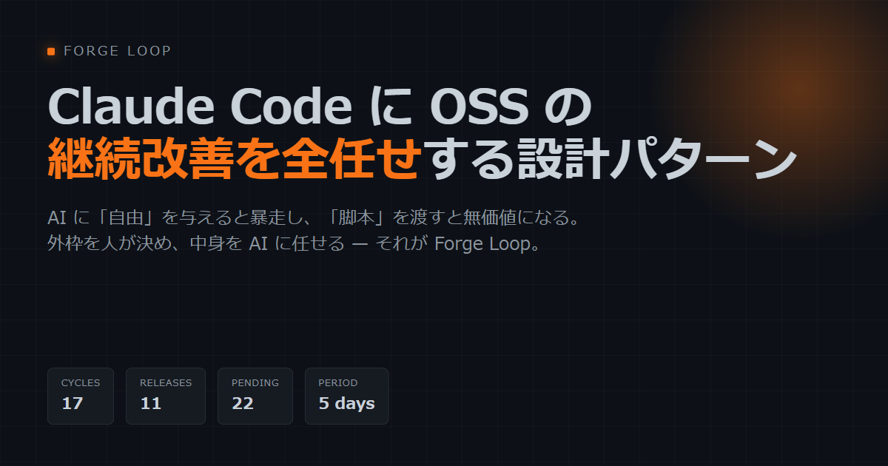
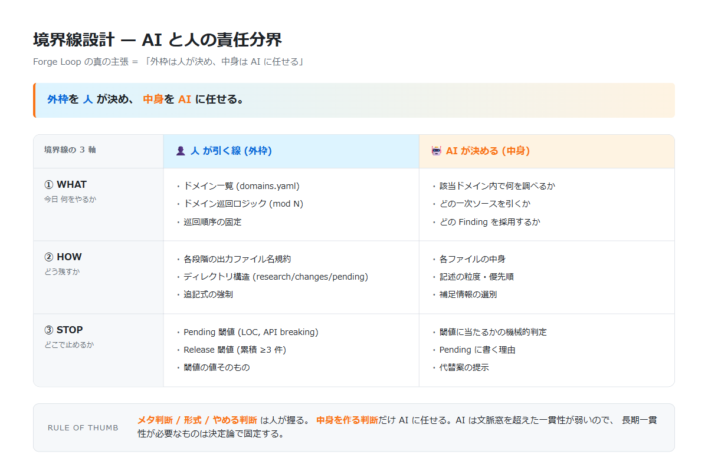

# Forge Loop

> **自分の OSS を Claude Code に任せて、寝ている間に勝手に育てる仕組み。**



[]()
[]()

---

## こんな経験、ないですか?

個人で OSS を作っていて、こういう状態:

- 久しぶりに repo を開いたら issue が 30 件溜まっている
- 修正したいけど、仕事や生活で手が回らない
- 半年前の release から先に進まない

このリポジトリは、**Claude Code を 6 時間おきに動かして、自分の OSS を勝手に改修してもらう**仕組みのテンプレートです。

実例 ([Aigis](https://github.com/killertcell428/aigis) という Python 製 OSS) では:
- **5 日間で 17 サイクル**回り
- **PyPI に 11 回リリース**された (v1.0.1 → v1.0.12)
- **22 件**が「人レビュー待ち」フォルダで待機中

詳しい話は [Zenn 記事](https://zenn.dev/) を読んでみてください。

---

## 3 ステップで始める

### ① clone する

```bash
git clone https://github.com/killertcell428/forge-loop
cd your-oss-repo  # 自分の OSS リポジトリへ
cp -r ../forge-loop/template/auto-improvement ./
cp ../forge-loop/template/.github/workflows/forge-cycle.yml .github/workflows/
```

### ② 改修したい "分野" を書く

`auto-improvement/domains.yaml` を自分の OSS 用に書き換え:

```yaml
domains:
  - id: 0
    name: api-reference        # API リファレンス
  - id: 1
    name: getting-started      # 入門ガイド
  - id: 2
    name: troubleshooting      # トラブルシューティング
  # ... 5〜10 個程度
```

5〜10 個が丁度いい。少なすぎると同じ題材を頻繁に触りすぎる、多すぎると 1 分野あたりの頻度が下がる。

### ③ Secrets を設定

GitHub Actions の Secrets に `ANTHROPIC_API_KEY` を入れる。これだけ。

6 時間ごとに勝手に走り始めます。

---

## AI に丸投げで暴走しないの?

します。**最初の数回は実際に暴走しました**。

| 失敗 | 起きたこと |
|---|---|
| 同じ題材を 3 回連続で触る | 流行追従、退屈な改修 |
| 「考えただけ」で何もしないサイクル | 監査不能 |
| 大規模 API 変更を勝手に merge | repo が一時的に壊れる |

これを防ぐために、**外枠を人が決めて、中身だけ AI に任せる** 構造にしています。



3 つの工夫:

### 🗓 ① おかず当番表 (Rotate)

「次に何をやるか」を AI に選ばせない。`domains.yaml` に書いた順番で **mod N で巡回**する。
これで「楽な題材ばかり」「流行に流される」を防げます。

### 📝 ② 必ずメモを取らせる (Materialize)

各段階の出力が必ずファイルに残る規約:

```
auto-improvement/
├── research/  ← 何を調べたか
├── changes/   ← 何を実装したか
└── pending/   ← 「やらない」と判断したもの
```

ファイルが残ってないと次の段階に進めない仕組み。これで AI の作業が全部追えます。

### 📦 ③ 怪しい変更は保留フォルダへ (Defer)

`pending/` という「やらないリスト」を AI に許可する。

```
これに当たる変更は AI が自分で保留:
  - 100 行を超える
  - 公開 API が変わる
  - 既存テストを書き換える必要がある
  - AI 自身が「自信ない」と感じる
```

「保留」という第 3 の出口を作ると、AI は「とにかく実装」に倒れなくなります。

---

## どんな OSS に向くか

「N 個の分野を継続的に育てたい」構造の OSS なら何でも:

| OSS タイプ | 分野の例 |
|---|---|
| ドキュメント生成 | チュートリアル / API ref / FAQ / 入門 / 移行ガイド |
| Linter / Formatter | 言語別 / 規約別 / セキュリティ系 |
| CLI ツール | サブコマンド別 / エラーメッセージ / ヘルプ |
| テスト生成 | モジュール別 / エッジケース別 |
| i18n リソース | 言語別 |

逆に **「1 つの大きな機能を一気に書きたい」** タイプは向きません。それは人がやる仕事。

---

## 実例: Aigis での運用ログ

Python 製の LLM セキュリティスキャナ [Aigis](https://github.com/killertcell428/aigis) で、5 日 / 17 サイクル / 11 リリース で運用中。

**実データは丸ごと公開**しています:

- [ROTATION.md](./examples/aigis/snapshot/ROTATION.md) — 10 分野の定義 + 現在のカウンタ
- [INDEX.md](./examples/aigis/snapshot/INDEX.md) — 全 17 サイクルの時系列ログ
- [pending/](./examples/aigis/snapshot/pending/) — 保留フォルダで眠っている 22 件の提案
- [research/](./examples/aigis/snapshot/research/) と [changes/](./examples/aigis/snapshot/changes/) — サンプル 3 サイクル分

これを眺めれば、Forge Loop が実物としてどう動くか分かります。

---

## リポジトリ構成

```
forge-loop/
├── README.md
├── CONCEPT.md              # 設計思想の北極星ドキュメント
├── docs/
│   ├── architecture.md     # 詳細設計
│   ├── boundary-design.md  # AI と人の境界線設計の指針
│   ├── adapters.md         # 自分の OSS への移植ガイド
│   └── case-aigis.md       # Aigis 事例集
├── plugin/                 # Claude Code Plugin (公式仕様準拠)
│   ├── .claude-plugin/plugin.json
│   ├── skills/{forge-research,plan,implement,test,release}/SKILL.md
│   └── agents/forge-orchestrator/AGENT.md
├── template/               # 新規プロジェクト用スターター
│   ├── auto-improvement/{ROTATION.md, INDEX.md, domains.yaml, ...}
│   └── .github/workflows/forge-cycle.yml
├── examples/aigis/snapshot/ # Aigis の実運用データ
└── articles/               # 解説記事 (Zenn / Qiita 版)
```

---

## ちなみに名前について

この「**AI に OSS の継続改善を任せる仕組み**」自体に名前を付けました: **Forge Loop**。

「鍛冶 (forge) のように毎日少しずつ叩き続ける」イメージです。
詳しい設計思想は [CONCEPT.md](./CONCEPT.md) に。

---

## ステータス

実験段階。Aigis での実運用は継続中。Plugin の marketplace 配布はまだ。
template/ をコピーして手で動かすことは今すぐ可能です。

## ライセンス

MIT
